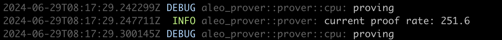

# 🤖 Autonomys Mining Tutorial - Linux




Please carefully read the Farmer deployment documentation and follow the steps to complete the cluster deployment process.


## Introduction

Autonomys-farmer consists of [**the following components**](https://github.com/oula-network/autonomys/releases):

* **autonomys-controller**: Responsible for proxying node RPC, used to manage cluster components.
* **sharded-cache**: Piece sharded cache.
* **full-piece-sharded-cache**: Full node of piece sharded cache.
* **proof-server**: GPU-based block generation, used for computing proofs.
* **plot-server**: Plotting service, responsible for encoding data.
* **plot-client**: Farming component, used for scanning disks and submitting solutions.

### Architecture

Currently, all cluster management is based on **NATS**, but the actual data transmission for the cache is done through **TCP** for peer-to-peer (P2P) communication.

<figure><figcaption></figcaption></figure>

### Recommended Software and Hardware Configuration

This software is only supported on Linux operating systems and Nvidia GPU environments.

#### **Operating System and Dependency Software**

* **Operating System**: Ubuntu 22.04
* **GPU Driver Version**: ≥ 525.60.13, or alternatively, install **CUDA 12.4** directly.
* **File System**: Ext4
* **Supervisor**: 4
* **NATS Server**: v2.10.22
* **numactl**: Required for managing NUMA (Non-Uniform Memory Access) nodes

#### Recommended Server Configuration

<table data-view="cards"><thead><tr><th>Server</th><th>CPU</th><th>MEM</th><th>GPU</th><th>SSD</th><th>Ethernet</th><th>Running Components</th></tr></thead><tbody><tr><td>Node</td><td>64 cores</td><td>64GB / 128GB</td><td>Required</td><td>500GiB</td><td>at least 1 Gbps</td><td><p><code>controller</code> </p><p><code>autonomys-node</code> </p><p><code>proof-server</code> </p><p><code>nats-server</code></p></td></tr><tr><td>Plotter</td><td>at least 30 cores per GPU</td><td>at least 64GB per GPU</td><td>Required</td><td>at least <strong>20 GiB</strong> for caching plot data</td><td>at least 20 Gbps</td><td><p><code>plot-server</code> </p><p><code>sharded-cache</code> </p><p><code>full-piece-cache</code></p></td></tr><tr><td>Storage</td><td>depending on the storage capacity</td><td>depending on the storage capacity</td><td>Not Required</td><td>depending on the storage capacity</td><td>at least 20 Gbps</td><td><code>plot-client</code></td></tr></tbody></table>

### Best Practices


**Note**: The following names, IP addresses and other details are examples.


#### Environment Overview

<table><thead><tr><th width="119">Server</th><th width="126">IP Address</th><th width="183">Configuration</th><th>Component</th></tr></thead><tbody><tr><td>Node 1</td><td>192.168.1.1</td><td>GPU * 1</td><td><p><code>controller</code> <code>autonomys-node</code> </p><p><code>proof-server</code> <code>nats-server</code></p></td></tr><tr><td>Node 2</td><td>192.168.1.2</td><td>GPU * 1</td><td><p><code>controller</code> <code>autonomys-node</code> </p><p><code>proof-server</code> <code>nats-server</code></p></td></tr><tr><td>Node 3</td><td>192.168.1.3</td><td>GPU * 1</td><td><p><code>controller</code> <code>autonomys-node</code> </p><p><code>proof-server</code> <code>nats-server</code></p></td></tr><tr><td>Plotter 1</td><td>192.168.1.4</td><td>GPU * 4</td><td><p><code>autonomys-plot-server-0</code> </p><p><code>autonomys-plot-server-1</code> </p><p><code>autonomys-plot-server-2</code> </p><p><code>autonomys-plot-server-3</code> </p><p><code>sharded-cache</code> <code>full-piece-cache</code></p></td></tr><tr><td>Plotter 2</td><td>192.168.1.5</td><td>GPU * 4</td><td><p><code>autonomys-plot-server-0</code> </p><p><code>autonomys-plot-server-1</code> </p><p><code>autonomys-plot-server-2</code> </p><p><code>autonomys-plot-server-3</code> </p><p><code>sharded-cache</code> <code>full-piece-cache</code></p></td></tr><tr><td>Storage 1</td><td>192.168.1.6</td><td><p>8T NVMe SSD * 4 </p><p><code>/mnt/nvme0n1</code> </p><p><code>/mnt/nvme0n2</code> </p><p><code>/mnt/nvme1n2</code> </p><p><code>/mnt/nvme1n1</code></p></td><td><code>autonomys-plot-client</code></td></tr><tr><td>Storage 2</td><td>192.168.1.7</td><td><p>8T NVMe SSD * 4 </p><p><code>/mnt/nvme0n1</code> </p><p><code>/mnt/nvme0n2</code> </p><p><code>/mnt/nvme1n1</code> </p><p><code>/mnt/nvme1n2</code></p></td><td><code>autonomys-plot-client</code></td></tr></tbody></table>

#### Supervisor Configuration

#### Node Configuration


Each node requires the deployment of 4 components: `controller` `autonomys-node` `proof-server` `nats-server`&#x20;

Deployment sequence: `nats-server` -> `autonomys-node` -> `controller` -> `proof-server`&#x20;


<mark style="color:yellow;">**nats-server**</mark>


This software requires the **JetStream** feature to be enabled in **nats-server**. To activate JetStream, simply start **nats-server** with the `--jetstream` flag.

For **nats-server** configuration, please refer to[ **the official NATS documentation** ](https://docs.nats.io/running-a-nats-service/configuration/clustering)as well as [the **Autonomys NATS configuration documentation**](https://docs.autonomys.xyz/farming/advanced-cli/cluster/#core-messaging-technology-natsio).


Here is an example configuration for **nats-server** for your reference.

```sh
server_name=n1-cluster
max_payload = 3MB

jetstream {
   store_dir=/var/nats-data
}


cluster {
  name: c1-cluster
  listen: 0.0.0.0:4248
  routes: [
    nats://192.168.0.1:4248
    nats://192.168.0.2:4248
  ]
}
```

<mark style="color:yellow;">**autonomys-controller**</mark>


```ini
# autonomys-controller Configuration
# /etc/supervisor/conf.d/autonomys-controller.conf

[program:autonomys-controller]
command=/root/autonomys/autonomys-farmer cluster --nats-server nats://192.168.1.1:4222 --nats-server nats://192.168.1.2:4222 --nats-server nats://192.168.1.2:4222 controller --tmp --node-rpc-url ws://10.30.1.2:9944
autorestart=true
user=root
redirect_stderr=true
stdout_logfile_maxbytes=100MB
stdout_logfile_backups=2
stdout_logfile=/var/log/autonomys-controller.log
```


<mark style="color:yellow;">**autonomys-node**</mark>


```ini
# autonomys-node Configuration
# /etc/supervisor/conf.d/autonomys-node.conf

[program:autonomys-node]
command=/root/autonomys/autonomys-node run --base-path /var/autonomys-node --farmer --rpc-listen-on 0.0.0.0:9944 --chain taurus --sync full --rpc-methods unsafe --rpc-cors all
autorestart=true
user=root
redirect_stderr=true
stdout_logfile_maxbytes=100MB
stdout_logfile_backups=2
stdout_logfile=/var/log/autonomys-node.log
```


<mark style="color:yellow;">**autonomys-proof-server**</mark>


```ini
# autonomys-proof-server Configuration
# /etc/supervisor/conf.d/autonomys-proof-server.conf

[program:autonomys-proof-server]
command=/root/autonomys/autonomys-farmer cluster --nats-server nats://192.168.1.1:4222 --nats-server nats://192.168.1.2:4222 --nats-server nats://192.168.1.2:4222 proof-server
autorestart=true
user=root
environment=CUDA_VISIBLE_DEVICES=0
redirect_stderr=true
stdout_logfile_maxbytes=500MB
stdout_logfile_backups=2
stdout_logfile=/var/log/autonomys-proof-server.log
```


#### Explanation of Startup Command Parameters and Environment Variables:

* `--nats-server` : This parameter is used to specify the address of the NATS server.
* `CUDA_VISIBLE_DEVICES`: This environment variable is used to specify which GPU to use. For example, `0` represents GPU0, `1` represents GPU1, and so on.

***

**Plotter Configuration (Example with 4 GPUs)**


Each plotter requires the deployment of e components:  `autonomys-plot-server`, `autonomys-sharded-cache`and `autonomys-full-piece-cache`

The `autonomys-plot-server` component retrieves pieces from both the `autonomys-sharded-cache` and `autonomys-full-piece-cache` components for use on the **plotting drive**.&#x20;


<mark style="color:yellow;">**autonomys-sharded-cache**</mark>


```ini
# sharded-cache Configuration
# /etc/supervisor/conf.d/autonomys-sharded-cache.conf

[program:autonomys-sharded-cache]
command=/root/autonomys/autonomys-farmer cluster --nats-server nats://192.168.1.1:4222 --nats-server nats://192.168.1.2:4222 --nats-server nats://192.168.1.2:4222 sharded-cache path=/var/autonomys-sharded-cache
autorestart=true
user=root
redirect_stderr=true
stdout_logfile_maxbytes=100MB
stdout_logfile_backups=2
stdout_logfile=/var/log/autonomys-sharded-cache.log
```


#### Explanation of Startup Command Parameters:

* `--nats-server`: Specifies the address of the NATS server.
* `path=/path/to/autonomys-sharded-cache`: Specifies the storage path for the piece cache.

<mark style="color:yellow;">**autonomys-full-piece**</mark>


```ini
# autonomys-full-piece 配置
# /etc/supervisor/conf.d/autonomys-full-piece.conf

[program:autonomys-full-piece]
command=/root/autonomys/autonomys-farmer cluster --nats-server nats://192.168.1.1:4222 --nats-server nats://192.168.1.2:4222 --nats-server nats://192.168.1.2:4222 full-piece-sharded-cache --tmp path=/var/autonomys-full-piece
autorestart=true
user=root
redirect_stderr=true
stdout_logfile_maxbytes=100MB
stdout_logfile_backups=2
stdout_logfile=/var/log/autonomys-full-piece.log
```


#### Explanation of Startup Command Parameters:

* `--nats-server` : This parameter is used to specify the address of the NATS server.
* `path=/path/to/autonomys-full-piece`: This parameter is used to specify the storage path for the piece cache.

<mark style="color:yellow;">**autonomys-plot-server**</mark>


```ini
# autonomys-plot-server 配置文件
# /etc/supervisor/conf.d/autonomys-plot-server.conf

[group:autonomys-plot-server]
programs=autonomys-plot-server-0,autonomys-plot-server-1,autonomys-plot-server-2,autonomys-plot-server-3
[program:autonomys-plot-server-0]
command=numactl -C 0-31 -l /root/autonomys/autonomys-farmer cluster --nats-server nats://192.168.1.1:4222 --nats-server nats://192.168.1.2:4222 --nats-server nats://192.168.1.2:4222 plot-server --priority-cache --listen-port 9966 /var/plot-server/base-path-0
autorestart=true
user=root
environment=CUDA_VISIBLE_DEVICES=0
redirect_stderr=true
stdout_logfile_maxbytes=100MB
stdout_logfile_backups=2
stdout_logfile=/var/log/autonomys-plotter-0.log

[program:autonomys-plot-server-1]
command=numactl -C 96-127 -l /root/autonomys/autonomys-farmer cluster --nats-server nats://192.168.1.1:4222 --nats-server nats://192.168.1.2:4222 --nats-server nats://192.168.1.2:4222 plot-server --priority-cache --listen-port 9967 /var/plot-server/base-path-1
autorestart=true
user=root
environment=CUDA_VISIBLE_DEVICES=1
redirect_stderr=true
stdout_logfile_maxbytes=100MB
stdout_logfile_backups=2
stdout_logfile=/var/log/autonomys-plotter-1.log

[program:autonomys-plot-server-2]
command=numactl -C 96-127 -l /root/autonomys/autonomys-farmer cluster --nats-server nats://192.168.1.1:4222 --nats-server nats://192.168.1.2:4222 --nats-server nats://192.168.1.2:4222 plot-server --priority-cache --listen-port 9968 /var/plot-server/base-path-2
autorestart=true
user=root
environment=CUDA_VISIBLE_DEVICES=2
redirect_stderr=true
stdout_logfile_maxbytes=100MB
stdout_logfile_backups=2
stdout_logfile=/var/log/autonomys-plotter-2.log

[program:autonomys-plot-server-3]
command=numactl -C 144-175 -l /root/autonomys/autonomys-farmer cluster --nats-server nats://192.168.1.1:4222 --nats-server nats://192.168.1.2:4222 --nats-server nats://192.168.1.2:4222 plot-server --priority-cache --listen-port 9969 /var/plot-server/base-path-3
autorestart=true
user=root
environment=CUDA_VISIBLE_DEVICES=3
redirect_stderr=true
stdout_logfile_maxbytes=100MB
stdout_logfile_backups=2
stdout_logfile=/var/log/autonomys-plotter-3.log
```


#### Explanation of Startup Command Parameters and Environment Variables:

* `--nats-server`: Specifies the address of the NATS server.
* `CUDA_VISIBLE_DEVICES`: Sets the GPU to be used, where `0` represents GPU0, `1` represents GPU1, and so forth.
* `GPU_CONCURRENCY`: Increasing this value raises GPU memory usage. Adjusting this variable may be beneficial when using GPUs of different models.


It is important to note that when using the **numactl** tool to bind CPU cores, you should consider the **NUMA affinity** of the GPU to achieve optimal performance.


You can use the **`nvidia-smi topo -m`** command to check the NUMA affinity of the GPU.

```sh
# nvidia-smi topo -m
        GPU0    GPU1    NIC0    NIC1    CPU Affinity    NUMA Affinity   GPU NUMA ID
GPU0     X      SYS     NODE    NODE    0-47,96-143     0               N/A
GPU1     X      SYS     NODE    NODE    0-47,96-143     0               N/A
GPU2    SYS      X      SYS     SYS     48-95,144-191   1               N/A
GPU3    SYS      X      SYS     SYS     48-95,144-191   1               N/A
NIC0    NODE    SYS      X      PIX
NIC1    NODE    SYS     PIX      X

Legend:

  X    = Self
  SYS  = Connection traversing PCIe as well as the SMP interconnect between NUMA nodes (e.g., QPI/UPI)
  NODE = Connection traversing PCIe as well as the interconnect between PCIe Host Bridges within a NUMA node
  PHB  = Connection traversing PCIe as well as a PCIe Host Bridge (typically the CPU)
  PXB  = Connection traversing multiple PCIe bridges (without traversing the PCIe Host Bridge)
  PIX  = Connection traversing at most a single PCIe bridge
  NV#  = Connection traversing a bonded set of # NVLinks

NIC Legend:

  NIC0: mlx5_0
  NIC1: mlx5_1
```

***

#### **Storage Configuration** (Example with 4 Drives)

<mark style="color:yellow;">**autonomys-plot-client**</mark>


```ini
# autonomys-plot-client Configuration
# /etc/supervisor/conf.d/autonomys-plot-client.conf

[program:autonomys-plot-client]
command=/root/autonomys/autonomys-farmer cluster --nats-server nats://192.168.1.1:4222 --nats-server nats://192.168.1.2:4222 --nats-server nats://192.168.1.2:4222 plot-client --reward-address stBR..S8V  path=/mnt/nvme0n1/,sectors=8000 path=/mnt/nvme0n2/,sectors=8000 path=/mnt/nvme1n0/,sectors=8000 path=/mnt/nvme1n1/,sectors=8000
autorestart=true
user=root
redirect_stderr=true
stdout_logfile_maxbytes=100MB
stdout_logfile_backups=2
stdout_logfile=/var/log/autonomys-plot-client.log
```


#### Explanation of Startup Command Parameters:

* `--nats-server` : Used to specify the address of the NATS server.
* `path=/path/to/plot-dir,sectors=8000`: Specifies the file path for plots as well as the number of sectors for the plot, with `8000` as the sector count in this example.

## Appendix

### **Using the Command**

Execute the command to manually initialize the cluster. The entire cluster will be reinitialized after **n** seconds.

```sh
autonomys-farmer util \
reinitialization-cache \
    --nats-servers nats://192.168.200.6:4222 \
    --delay 0
```

• `--delay 0`: Initialization delay, in seconds.

Simulate the **plot download sector** process by sending requests to the cache cluster and checking the cluster status.

```sh
autonomys-farmer util \
sharded-cache-benchmark \
    --nats-servers nats://192.168.0.2:4222 \
    --sectors 256 \
    --epoch 1 \
    --cache-item-type split-parity-piece
```

***

### Autonomys Piece Conversion Tool

The Autonomys Piece Conversion Tool allows you to convert data synchronized by `autonomys-node` into `piece` cache data. Please follow the steps below to export `piece` cache data:

1.  Use the following command:

    ```bash
    NODE_URL="http://192.168.1.1:9944" ./autonomys-export-piece
    ```
2. After executing the command, the generated `piece` data will be automatically saved to the `full-cache-tmp` directory on your local machine.
3. Simply set the `path` parameter of the `autonomys-full-piece` component to this directory.


**Note**: The startup command for `autonomys-node` specified in `NODE_URL` must include the `--sync=full` parameter.



[**Back to Oula**](https://oula.network/en/login)
